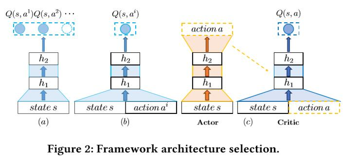
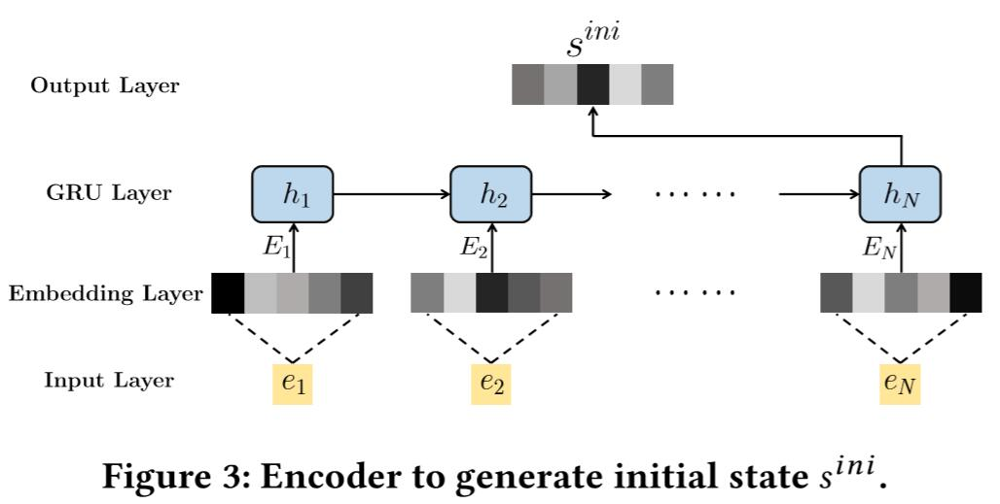
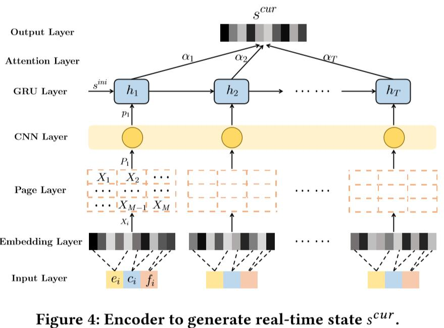
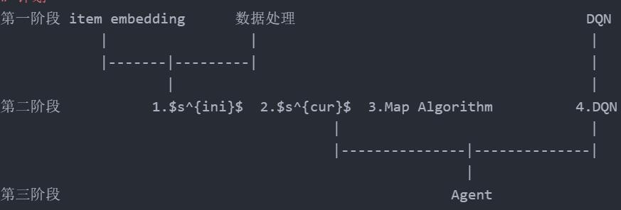

# 2. THE PROPOSED FRAMEWORK
## 2.1 Frame Overview
在Section1中，我们将推荐任务看成是马尔可夫决策过程(MDP)和RL来自动学习优化推荐策略。定义一下元组 $(S,A,P,R,\gamma)$ 来表示MDP，
- **State space $S$** $s \in S$来表示用户的当前偏好，是基于用户的浏览历史构建的，比如根据浏览的item和对应的feedback
- **Action space A** 是一组action集合：$a = \{a^1, a^2, ...a^M\} \in A$是用户在状态$s$下，对一页M个item的feedback.
- **Reward R**: RA在状态$s$下决定出$a$后，agent根据用户的feedback立即得到的reward $r(s,a)$
- **Transition P**: 转移概率矩阵$p(s\prime|s,a)$是在RA采用action $a$后，从状态$s$转移到$s\prime$的概率。
- **Discount facotr $\gamma$**: RL中的经典一项，[0,1]，0表示只考虑当前的reward，1表示考虑所有的reward累积。

详细的说，recommender agent(RA)与环境 $\epsilon$ 随着time-step进行交互。每一个time-step，RA根据环境的状态s决定action a，然后得到reward r(s,a)。随着一系列的action a,环境 $\epsilon$ 会根据transition $p(s\prime|s,a)$ 来改变s。RL的目标就是寻找 推荐决策(recommendation policy) $\pi: S \rightarrow A$，它能最后话累积reward。

传统的Q-learning和POMDP方法随着item的增加而不适用。
>we leverage Deep Reinforcement Learning[20] with (adapted) artificial neural networks as the nonline arapproximators to estimate the action-value functioninRL.

这个模型不在预测概率矩阵，也不再存储Q-value表，因此适用于有大量的items的推荐系统。

两个挑战：
- 动态且高维的 action space(item space)
- 选择最优的action计算成本巨大
- 对每个state-action对计算Q-value太耗时

首先对item进行了嵌入学习表示。

我们的方法：Actor-Critic framework 如图中( c ):

图2(a)中的conventional Deep Q-learning结构只需要输入state space，输出所有的actions的Q-values。  
第二个 conventional Deep Q-learning(b)输入为state-action元组，输出对应的Q-value值。这是最优政策可实现的最大预期回报，应遵循Bellman方程：
$$Q^*(s,a) = E_{s^\prime}[r + \gamma max_{a^\prime} Q^*(s^\prime, a^\prime)| s,a]$$
这个结构对每个$a^\prime$计算Q-value，然后选择最大的一个。  
ACtor-Critic架构，输入是当前状态s，目标是输出决策的action(或一页M个item)，$s\rightarrow a = \{a^1,a^2,...a^M\}$,Critic输出值是当前的state-action元组而不是所有可能的state-action元组。计算：
$$Q(s,a) = E_{s^\prime}[r+\gamma(s^\prime,a^\prime)|s,a]$$
Q(s,a)是评判所选择action是否与当前状态s匹配。最后，根据结果更新Action的参数。

## 2.2 Actor Framework
Action是根据用户的preference，生成一页item。这需要解决三个问题
- 在一个新的用户会话时，如何初始化preference
- 学习用户的实时preference，它能表示当前会话用户preference的动态属性和item display patern
- 连续生成一组推荐item并用2-D页面显示它们。

## 2.2.1 Encoder for Initial State Generation Process

公式3-6，得到 $s^{ini} = h_t$

## 2.2.2Encoder for Real-time State Generation Process
  
在page-wise推荐系统，$x_1,...,x_M$为输入，表示的是items和用户对应的feedback。M是推荐item的数量，xi是：
$$x_i = (e_i,c_i,f_i)$$ 
$e_i$是item representation。$c_i$是item's category $c_i$，one-hot形式。$f_i$是ont-hot，表示用户的feedback。fi ci都是通过嵌入学习的，但ei是固定用的之前训练好的。

用之前的 $s^{ini}$ 初始化GRU的第一个。

最后得到$s^{cur}$

## 2.2.3 Decoder for Action Generation Process. 
这一部分是生成新的一页item。使用deconvolution neural network得到$a^{cur}$
- $a^{cur}$和P维度不一样，前者只包含item embedding Ei,后者还包含Ci,Fi。比如后者是 $h \times W|X|$ ， 前者是 $h \times W|E|$
- 生成的item embedding不一定在真正的item embedding中，所以需要进行一下映射，之后说。

# 2.3 The Architecture of Critic Framework
Critic的目标在于近似学习Q-value函数Q(s,a)，用来评判生成的action a是否与当前状态s匹配。然后，根据Q(s,a)的结果，Actor更新它的参数。

输入为s和a，RA根据相同的策略(公式3-10)来学习用户的当前preference.公式12生成的 $a^{cur}$ 是2维矩阵，我们使用公式9，来将 $a^{cur}$ 转换成低维密集向量a:
$$a=conv2d(a^{cur})$$
然后使用DQN来实现Q(s,a)

# 3 TRAINING AND TEST PROCEDURE
## Mapping Algorithm

# 计划
第一阶段 item embedding      数据处理                                   DQN
            |                 |                                        |
            |-------|---------|                                        |
                    |                                                  |      
第二阶段           1.$s^{ini}$  2.$s^{cur}$  3.Map Algorithm          4.DQN  
                                        |                              |  
                                        |---------------|--------------|  
                                                        |  
第三阶段                                               Agent

|阶段|任务|时间|说明|
| :--:     | :--:           | :--:      | :--:                                               |
| 第一阶段 | item embedding | 2019-3-26 | 王锦龙，训练模型的所有细节                         |
| 第一阶段 | 数据处理       | 2019-3-26 | 张贺凯，完成action及feedback数据构建               |
| 第一阶段 | DQN            | 2019-3-26 | 滕志勇，完成DQN模型的使用，陈帅完成论文中DQN的细节 |
| 第二阶段 |  Encoder initial state | 2019-4-12 |    |
| 第二阶段 |  Encoder Real-time State | 2019-4-12 |    |
| 第二阶段 |  Map Algorithm | 2019-4-12 |    |
| 第二阶段 |  Decoder DQN | 2019-4-12 |    |
| 第二阶段 |  模块合并细节处理 | 2019-4-18 |    |
| 第三阶段 |  DQN | 2019-4-20 | 开始模块合并，完成Page-wise模型 |
